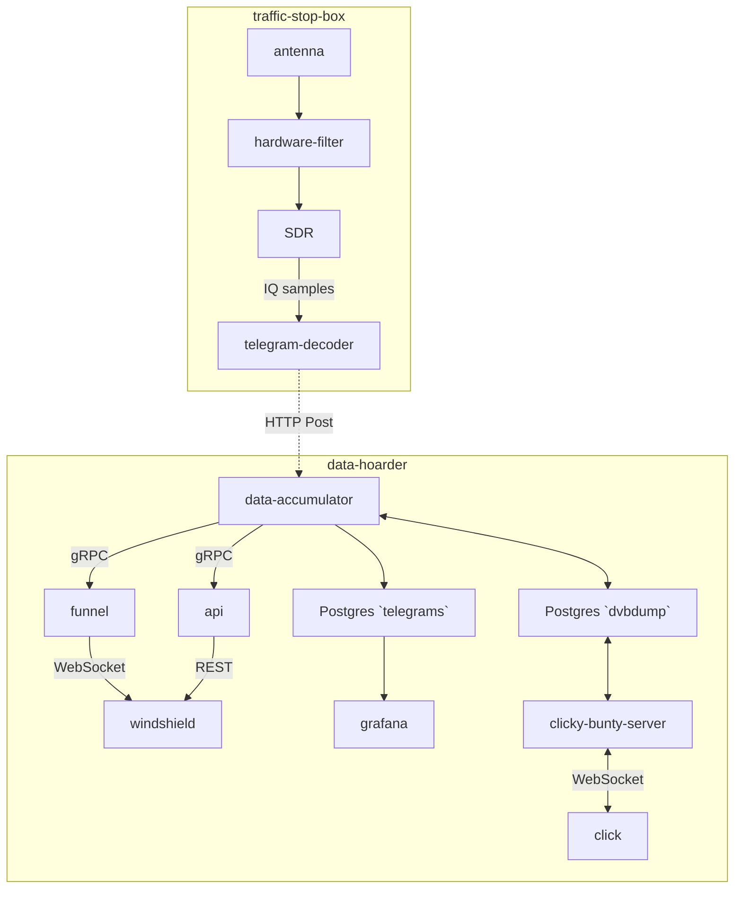

# Services and Dataflow

There quite a lot of services required to acquire and preset the public transport data.
The figure below shows the current services and which data in what format flows between them.
Clicking on different text boxes will open their GitHub repository or documentation.

